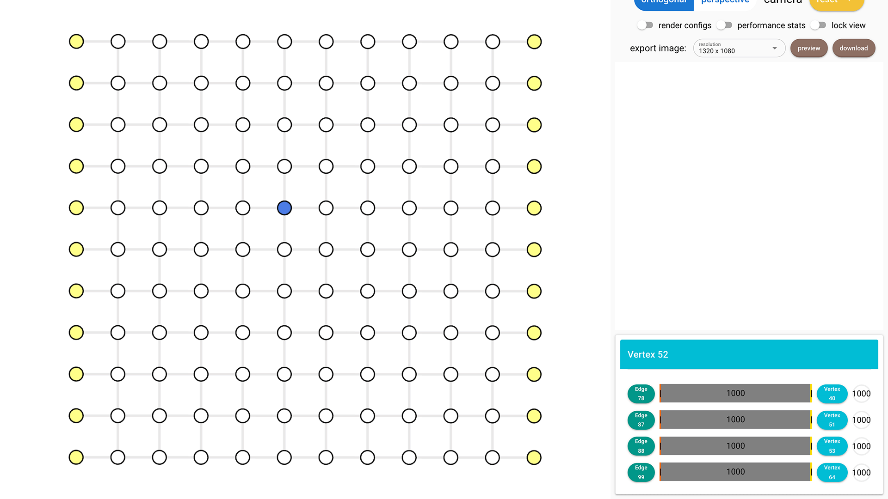

# Construct Syndrome

In this chapter you'll learn how to construct your own syndrome to decode.

You can [download the complete code here](./construct-syndrome.py).

## Code Initialization

We use a planar code as an example:

```python
import fusion_blossom as fb

code = fb.CodeCapacityPlanarCode(d=11, p=0.05, max_half_weight=500)
```

## Peek Graph [Optional]

If you want to customize the syndrome, it's easier to use the visualization tool to see which vertex you want to set to syndrome vertex.
You can open it with:

```python
fb.helper.peek_code(code)  # comment out after constructing the syndrome
```

Click on each vertex to see its index on the right bottom. In this example, I'm selecting vertex 52.



## Construct Syndrome

A syndrome pattern takes 2 inputs: `defect_vertices` and `erasures`. They both default to empty list `[]`.
We want to set vertex 52 as a syndrome vertex, so `defect_vertices = [52]`.
A usual case for quantum error correction would have much less defect vertices than real vertices.
For more details about `erasures`, please see [Decode Erasure Error Chapter](./decode-erasure-error.md).

```python
syndrome = fb.SyndromePattern(
    defect_vertices = [52],
)
```

## Visualize Result

The same process as in [Example QEC Codes Chapter](./example-qec-codes.md).

```python
visualizer = None
if True:  # change to False to disable visualizer for faster decoding
    visualize_filename = fb.static_visualize_data_filename()
    positions = code.get_positions()
    visualizer = fb.Visualizer(filepath=visualize_filename, positions=positions)

initializer = code.get_initializer()
solver = fb.SolverSerial(initializer)

solver.solve(syndrome)

subgraph = solver.subgraph(visualizer)
print(f"Minimum Weight Parity Subgraph (MWPS): {subgraph}")  # Vec<EdgeIndex>

if visualizer is not None:
    fb.print_visualize_link(filename=visualize_filename)
    fb.helper.open_visualizer(visualize_filename, open_browser=True)
```


